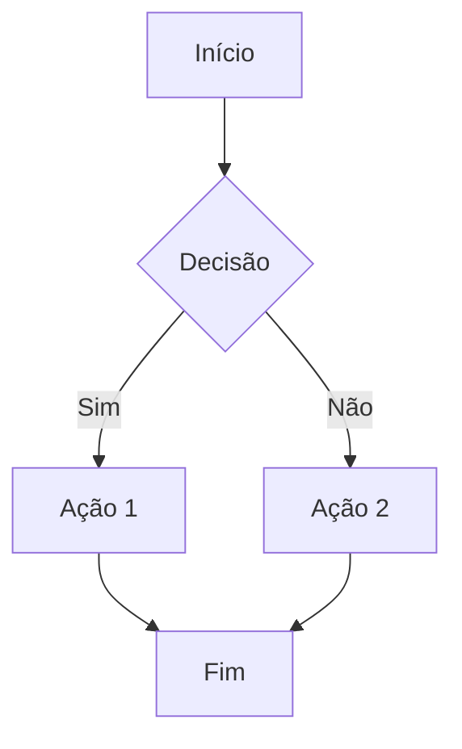

# Exemplo de Documento

Este é um exemplo de documento MDX que você pode usar como referência ao criar seus próprios documentos.

## Estrutura Básica

Todo documento MDX deve começar com um **frontmatter** (metadados entre `---`):

```yaml
---
title: Título do Documento
description: Descrição opcional
date: 2025-01-13
order: 1
---
```

### Campos do Frontmatter

- **`title`** (obrigatório): Título que aparece na sidebar e na página
- **`description`** (opcional): Descrição para SEO e previews
- **`date`** (opcional): Data de publicação
- **`order`** (opcional): Ordem na sidebar (menor = primeiro)

## Formatação de Texto

Você pode usar toda a sintaxe Markdown:

- **Negrito**
- *Itálico*
- ~~Riscado~~
- `Código inline`

## Cabeçalhos

Use `#` para criar seções hierárquicas:

```markdown
# Título Principal (H1)
## Seção (H2)
### Subseção (H3)
#### Sub-subseção (H4)
```

## Listas

### Lista Não Ordenada

- Item 1
- Item 2
  - Subitem 2.1
  - Subitem 2.2
- Item 3

### Lista Ordenada

1. Primeiro item
2. Segundo item
3. Terceiro item

## Código

### Código Inline

Use `código inline` para destacar comandos ou valores.

### Blocos de Código

```javascript
function exemplo() {
  console.log('Hello, World!');
  return true;
}
```

```python
def exemplo():
    print("Hello, World!")
    return True
```

## Links

- [Link externo](https://example.com)
- [Link interno](/docs/exemplo-documento)

## Imagens


## Tabelas

| Coluna 1 | Coluna 2 | Coluna 3 |
|----------|----------|----------|
| Dado 1   | Dado 2   | Dado 3   |
| Dado 4   | Dado 5   | Dado 6   |

## Citações

> Esta é uma citação de exemplo.
> Pode ter múltiplas linhas.

## Diagramas Mermaid

Você pode criar diagramas usando Mermaid:



## Componentes Especiais

Este template inclui componentes especiais que você pode usar:

- **Tabs**: Para organizar conteúdo em abas
- **Notes**: Para destacar informações importantes
- **Code Blocks**: Com syntax highlighting
- **Steps**: Para guias passo a passo

Consulte a documentação de componentes para mais detalhes.

## Dicas

1. **Organize por pastas**: Use subpastas em `/docs` para organizar seus documentos
2. **Use `order`**: Controle a ordem na sidebar com o campo `order`
3. **Mantenha títulos descritivos**: Facilita a busca e navegação
4. **Use descrições**: Melhora SEO e previews

---

**Pronto! Agora você sabe como criar seus documentos. 🎉**

