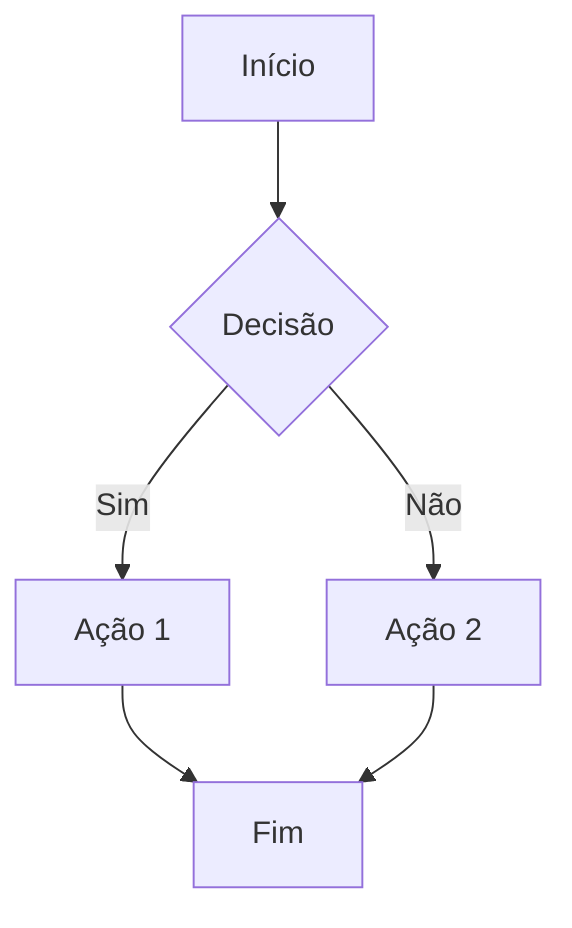
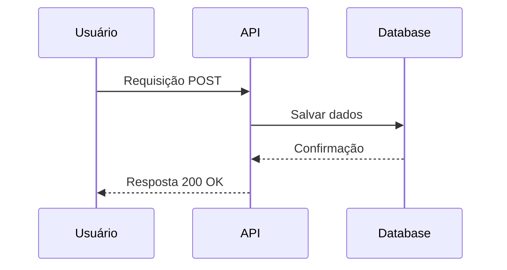
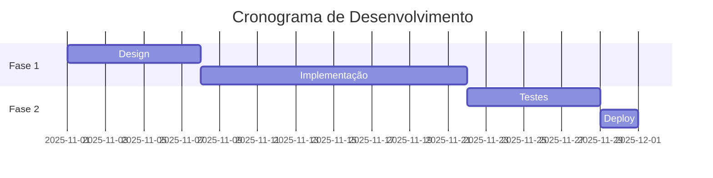
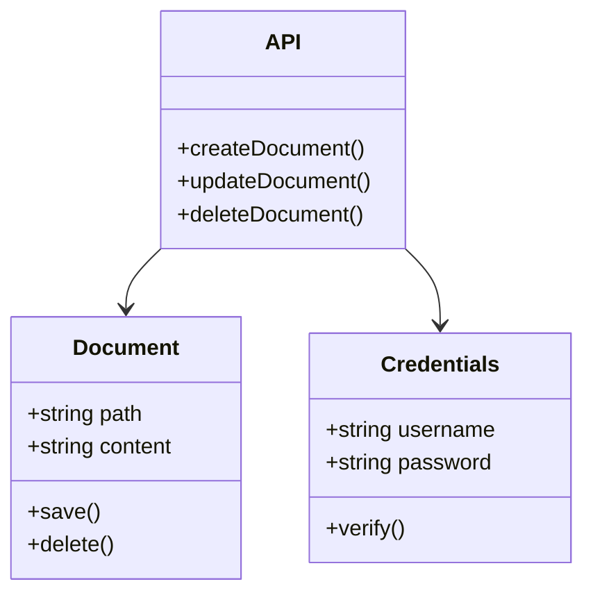
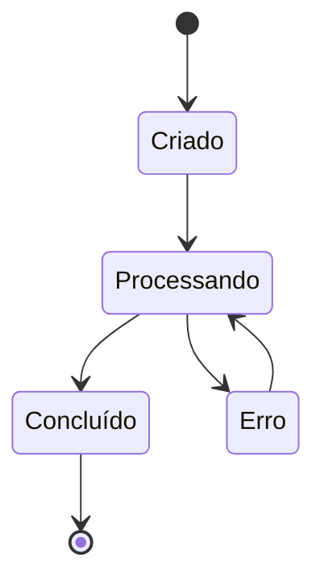
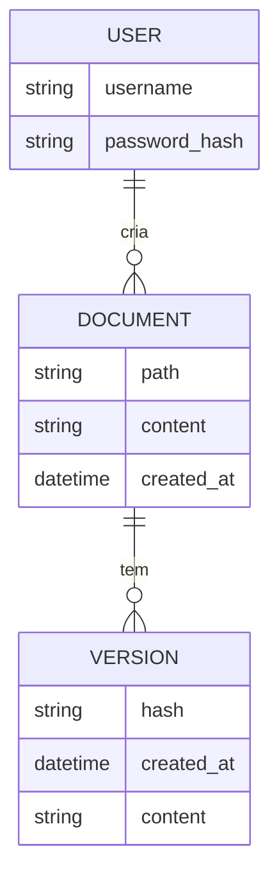
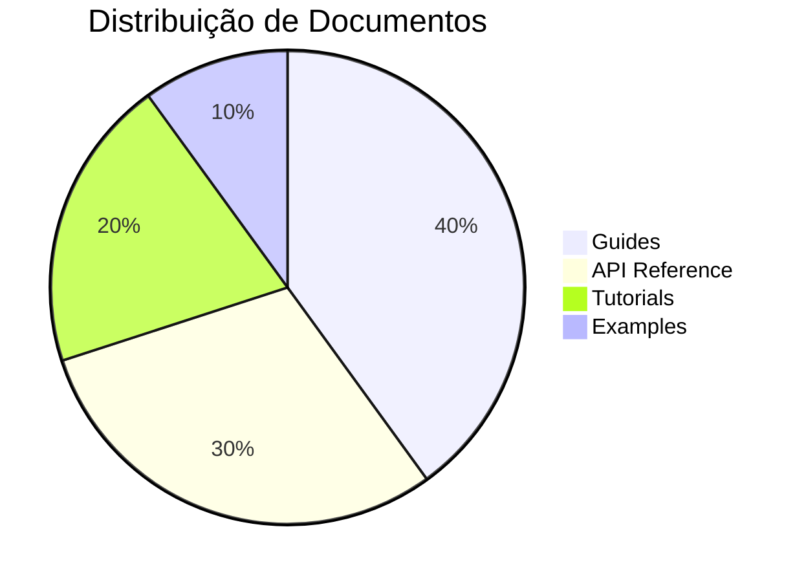
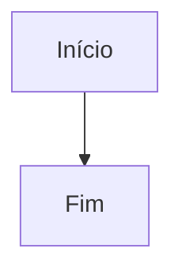

# Exemplos de Diagramas Mermaid

Esta página demonstra como usar diagramas Mermaid na documentação.

## Flowchart (Fluxograma)



## Sequence Diagram (Diagrama de Sequência)



## Gantt Chart (Gráfico de Gantt)



## Class Diagram (Diagrama de Classes)



## State Diagram (Diagrama de Estados)



## ER Diagram (Diagrama Entidade-Relacionamento)



## Pie Chart (Gráfico de Pizza)



## Git Graph (Gráfico Git)

```mermaid
gitgraph
    commit id: "Initial"
    branch develop
    checkout develop
    commit id: "Feature 1"
    commit id: "Feature 2"
    checkout main
    merge develop
    commit id: "Release"
```

## Como Usar

Para adicionar um diagrama Mermaid em seus documentos MDX, use um bloco de código com a linguagem `mermaid`:

````markdown

````

O diagrama será renderizado automaticamente com o tema ness (cores slate + #00ade8).

## Tipos de Diagramas Suportados

- Flowchart
- Sequence Diagram
- Gantt Chart
- Class Diagram
- State Diagram
- ER Diagram
- Pie Chart
- Git Graph
- E muitos outros!

Consulte a [documentação oficial do Mermaid](https://mermaid.js.org/) para mais exemplos e sintaxe.

