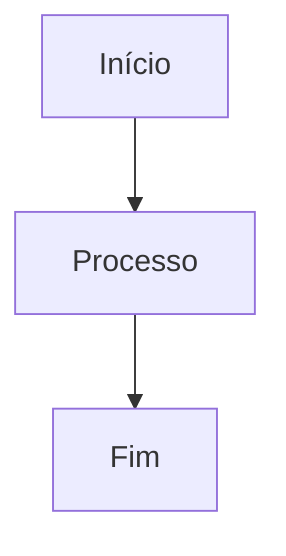

# Bem-vindo à Documentação ness

Esta é sua plataforma de documentação. Comece adicionando conteúdo criando arquivos MDX na pasta `/docs`.

## Como Começar

1. Crie um novo arquivo `.mdx` nesta pasta (ou em uma subpasta)
2. Adicione frontmatter com `title` e `description`
3. O arquivo será automaticamente processado pelo Contentlayer

## Exemplo

Crie um arquivo como `docs/getting-started.mdx`:

```mdx
---
title: "Primeiros Passos"
description: "Aprenda como começar"
---

# Primeiros Passos

Seu conteúdo aqui...
```

## Recursos

### Diagramas Mermaid

Você pode criar diagramas usando Mermaid:



Veja mais exemplos na página de [Exemplos de Mermaid](/docs/exemplos/mermaid).

## Estrutura de Arquivos

```
docs/
├── index.mdx          # Página inicial (esta página)
├── exemplos/          # Exemplos e tutoriais
│   └── mermaid.mdx    # Exemplos de diagramas
└── ...                # Seus documentos aqui
```
